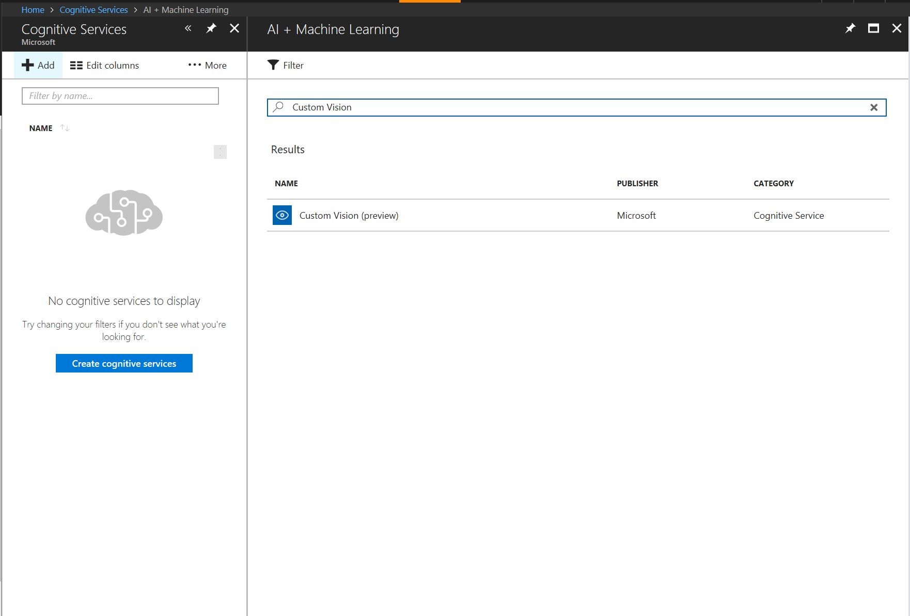
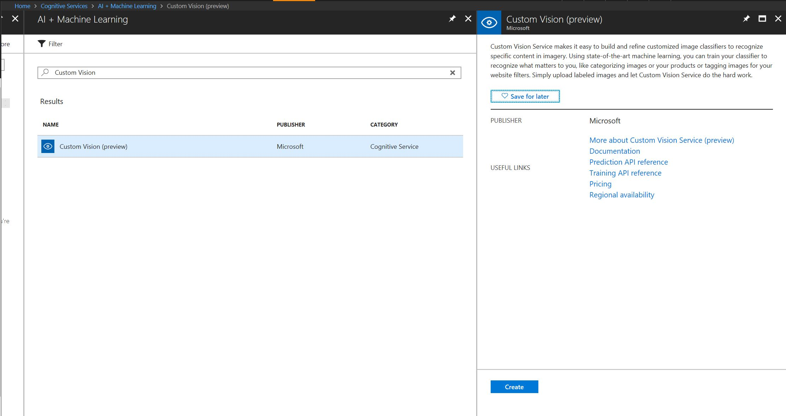
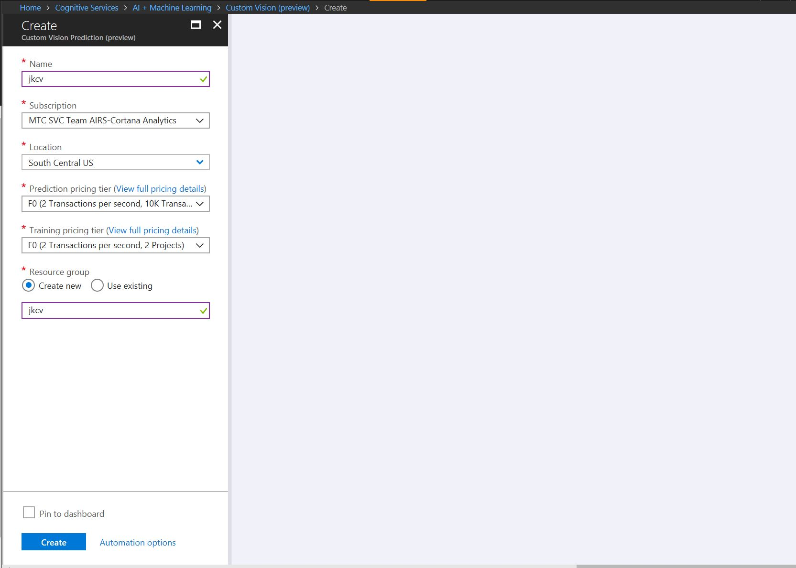
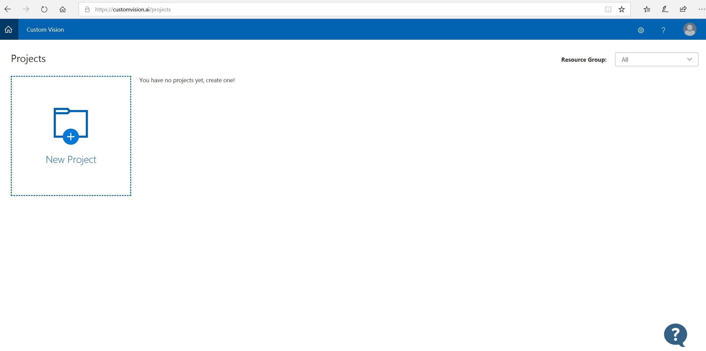

# Environment setup

The goal of this lab is to prepare the environment that will be utilized during the workshop. 

## Provision Cognitive Services

### Provision Custom Vision Service
We will use Azure Portal to provision Custom Vision service.
1. Navigate and login to Azure portal

https://portal.azure.com

2. Navigate to Custom Vision blade



3. Press `Create` button



4. Complet the form. Use `F0` plan for both prediction and training tiers. Note that the service is only available in South Central US region



5. Navigate to Custom Vision portal at

https://customvision.ai

6. Login using the same account you used to login to Azure Portal. You should see the following screen



## Install Custom Vision SDK
As indicated in the workshop prerequisities you should have Anaconda Python 3.5+ pre-installed. If you don't, know is the time

### Create conda env
This is an optional step but since we are installing a preview feature it is advisable to isolate it in a dedicated environment
```
conda create -n <Env name> python=3.5
```
If you prefer you can use Python 3.6
### Activate the newly created environment and install Custom Vision SDK
```
source activate <Env name>
pip install azure-cognitiveservices-vision-customvision
```


