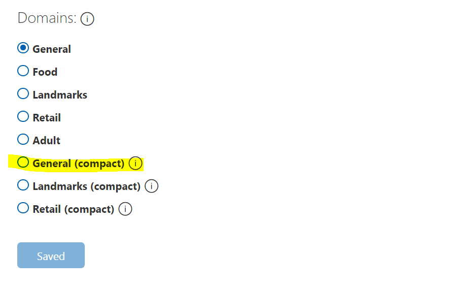
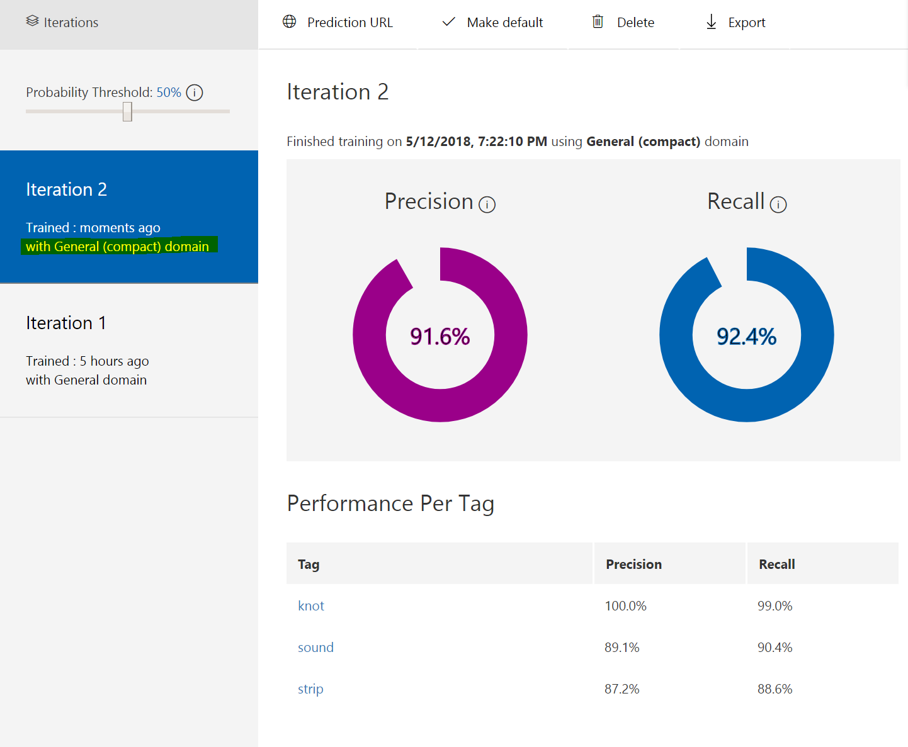

# Export your model as a docker container
In this section of the lab we will demonstrate how to export your trained classifier as a docker container.
The container includes a Tensorflow model and service code to use the Custom Vision Service API.

Custom Vision Service only exports compact domains. The models generated by compact domains are optimized for the constraints of real-time classification on low powered devices. Classifiers built with a compact domain may be slightly less accurate than a standard domain with the same amount of training data.

## Convert to a compact domain

If your classifier was not set to a compact domain (which is the case for classifier trained during the previous stages of the lab) you need to convert it.

To convert the domain of an existing classifier, use the following steps:

1. From the Custom vision page, select the Home icon to view a list of your projects. You can also use the https://customvision.ai/projects to see your projects.
2. Select your project, and then select the Gear icon in the upper right of the page.
3. In the **Domains** section, select a compact domain. **Save Changes** to save the changes.

## Retrain the model using a compact domain

## Export your model
To export the model after retraining, use the following steps:
1. Go to the Performance tab and select Export.
2. Select the export format (Docker), and then select Export to download the model.
3. Extract the downloaded `zip` file to the folder of your choice

The instructor will walk you through the content of the download.

