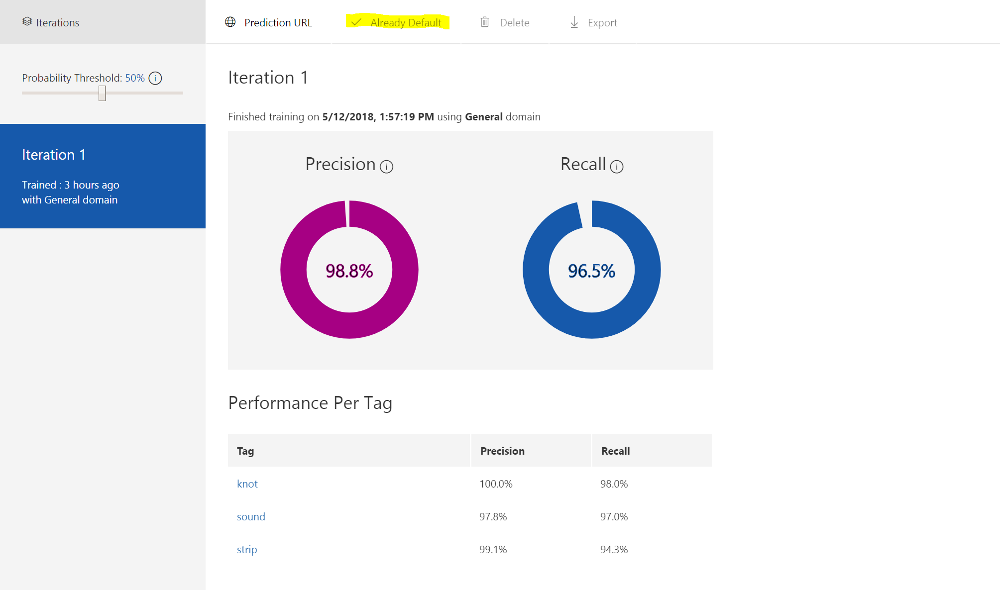

## Use the prediction endpoint to test images programmatically

Mark the current version of the service as default

The instructor will walk you through `predict.ipynb` Jupyter notebook that illustrates how to access a prediction end point for your model.
