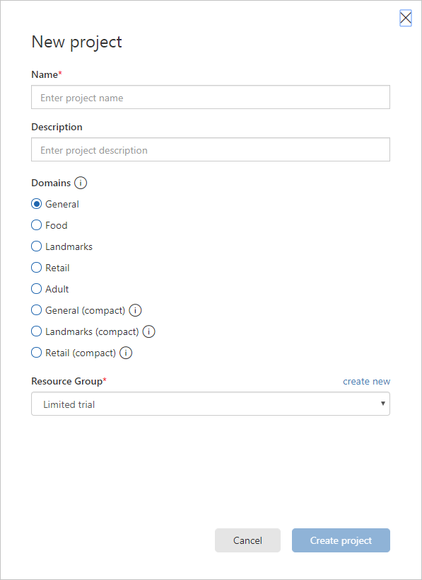

# Build an image classifier

In this lab, we will build an image classifier that can recognize and label blemishes on construction lumber. 

**Data courtesy of:**

Olli Silven       olli@ee.oulu.fi

Hannu Kauppinen    hsk@ee.oulu.fi

University of Oulu, Finland

http://www.ee.oulu.fi/research/imag/wood/WOOD/README

http://www.ee.oulu.fi/research/imag/wood/WOOD/

## Create a new project
To create a new project, use the following steps:
1. In your web browser, navigate to the Custom Vision web page !
[Custom Vision](https://customevision.ai). Select New Project. For your first project, you are asked to agree to the Terms of Service. 
Select the check box, and then select the I agree button. The New project dialog box appears.

3. Enter a name and a description for the project. You can then select one of the available domains. 
Each domain optimizes the classifier for specific types of images. In our lab, we are going to use the **Generic** domain
4. Select a Resource Group. The Resource Group dropdown shows you all of your Azure Resource Groups that include a Custom Vision Service Resource. Use the Resource Group that was provision during the environment set up.
5. To create the project, select **Create Project**.

