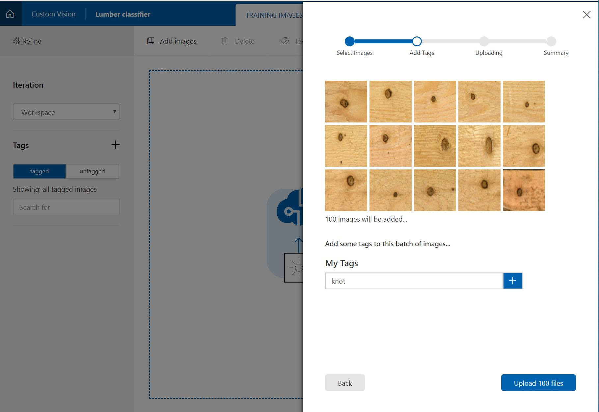
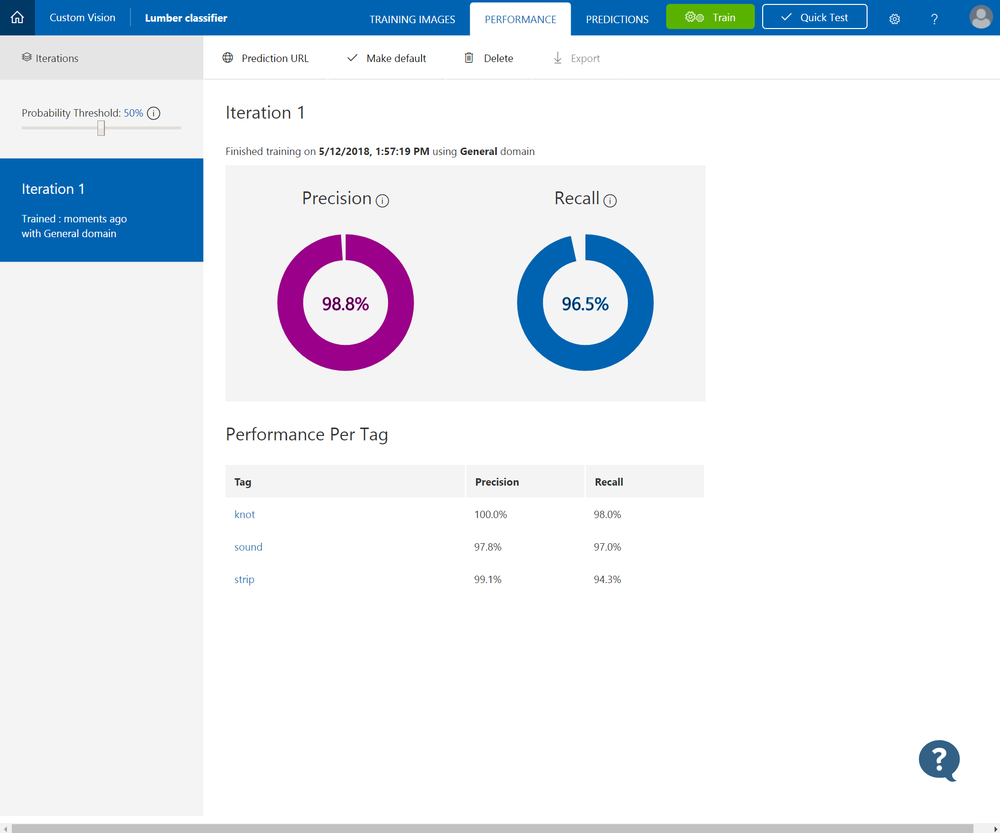
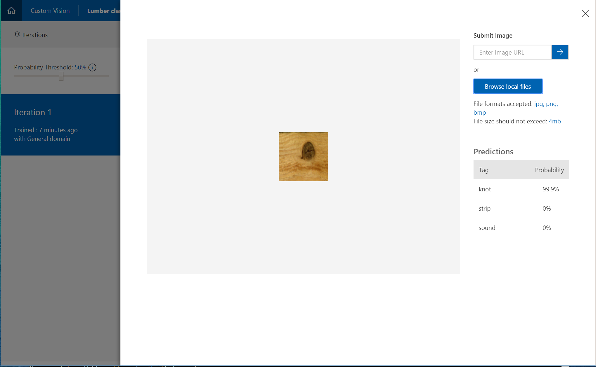
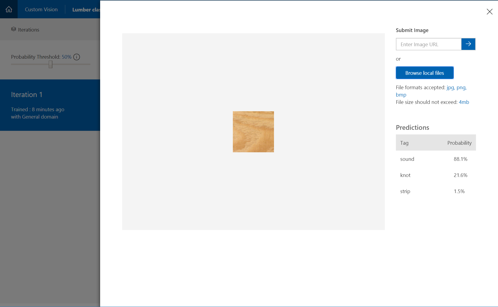

# Build an image classifier

In this lab, we will build an image classifier that can recognize and label blemishes on construction lumber. 

**Data courtesy of:**

Olli Silven       olli@ee.oulu.fi

Hannu Kauppinen    hsk@ee.oulu.fi

University of Oulu, Finland

http://www.ee.oulu.fi/research/imag/wood/WOOD/README

http://www.ee.oulu.fi/research/imag/wood/WOOD/

## Create a new project
To create a new project, use the following steps:
1. In your web browser, navigate to [Custom Vision web page](https://customvision.ai). 
Select New Project. For your first project, you are asked to agree to the Terms of Service. 
Select the check box, and then select the I agree button. The New project dialog box appears.

3. Enter a name and a description for the project. You can then select one of the available domains. 
Each domain optimizes the classifier for specific types of images. In our lab, we are going to use the **Generic** domain
4. Select a Resource Group. The Resource Group dropdown shows you all of your Azure Resource Groups that include a Custom Vision Service Resource. Use the Resource Group that was provision during the environment set up.
5. To create the project, select **Create Project**.

## Upload and tag training images
1. To add images to the classifier, use the Add images button and then select Browse local files. Select Open to move to tagging.

2. To set the tag, enter text in the My Tags field and then use the + button. 

3. To upload another set of images, return to step 1. For example, if you want to distinguish between knots and strips, upload and tag images of strips.

## Train and evaluate the classifier
1. To train the classifier, select the Train button.

## Test your model
1. From the Custom Vision web page, select your project. Select Quick Test on the right of the top menu bar. This action opens a window labeled Quick Test.
2. In the Quick Test window, click in the Submit Image field and enter the URL of the image you want to use for your test. If you want to use a locally stored image instead, click the Browse local files button and select a local image file.

3. Repeat the test for another image

## Use the prediction endpoint to test images programmatically

Mark the current version of the service as default

The instructor will walk you through `predict.ipynb` Jupyter notebook that illustrates how to access a prediction end point for your model.

